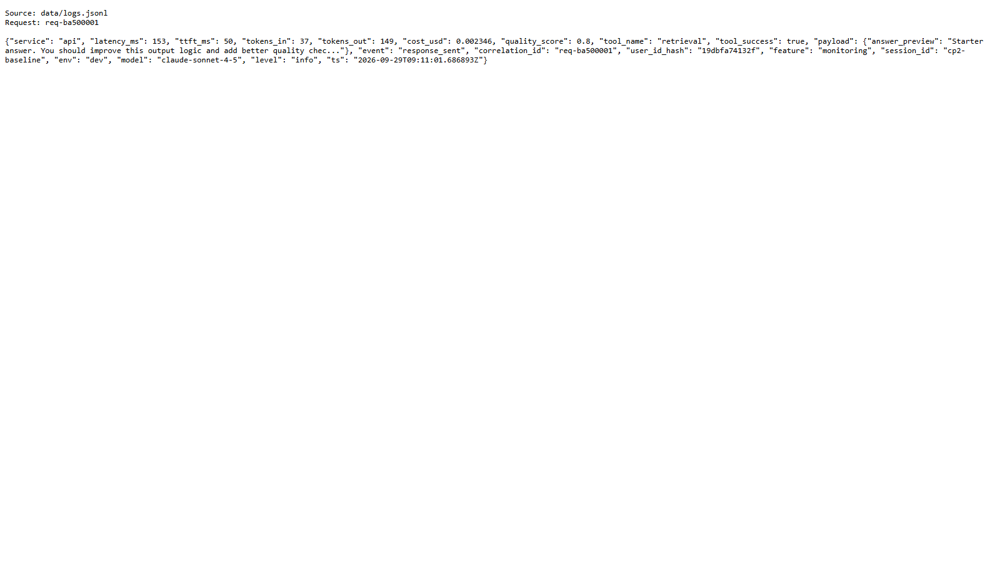
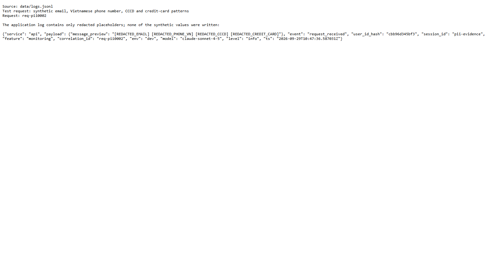
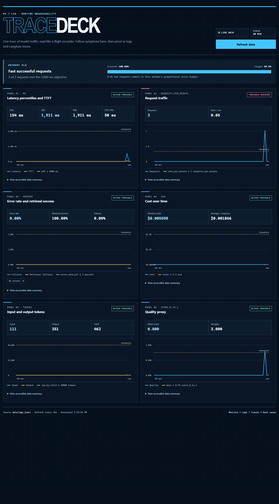
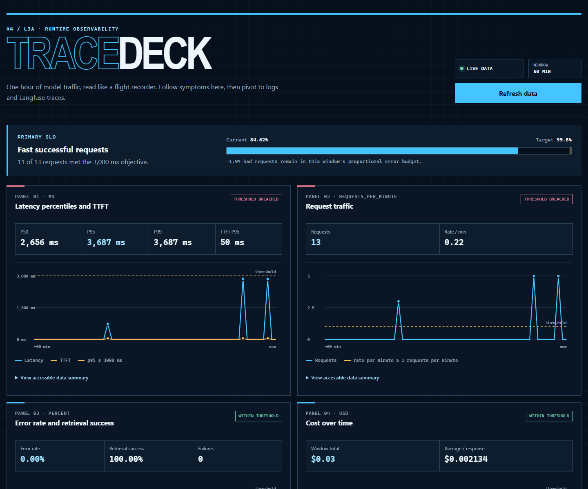
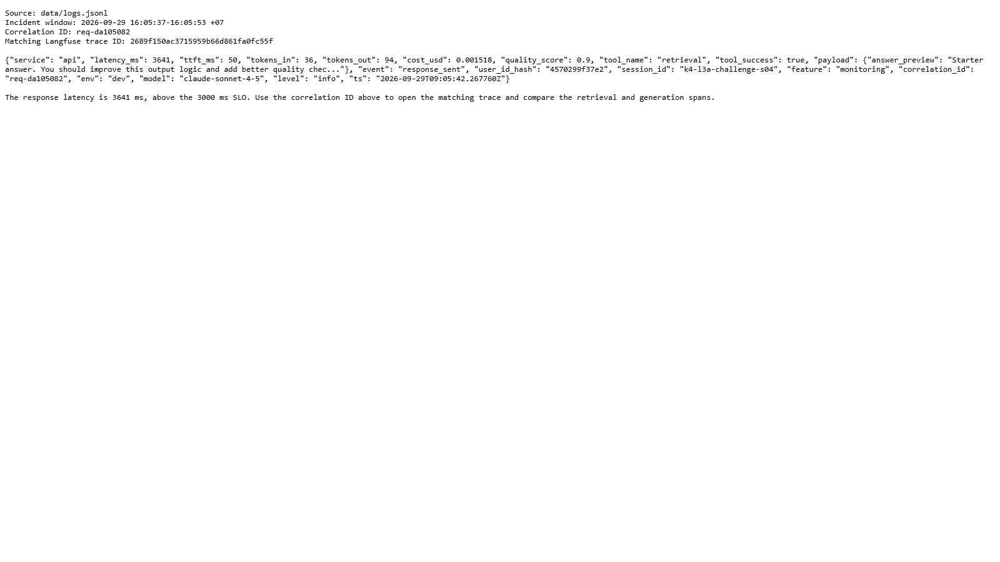

# Báo cáo cá nhân — K4-L3A Day 13 Monitoring & LLMOps

> Mỗi học viên hoàn thiện một file duy nhất này. Khi dẫn evidence, dùng đường dẫn tương đối, ví dụ `evidence/07-trace-waterfall.png`.

## 1. Thông tin học viên

- **Họ và tên:** Hồ Đình Tuấn Kiệt
- **MSSV:** 2A202602785
- **Lớp:** K4-L3A
- **Repository URL:** [github.com/Kayen-dev/K4-L3-DAY13-HoDinhTuanKiet-2A202602785-Monitoring-LLMOps](https://github.com/Kayen-dev/K4-L3-DAY13-HoDinhTuanKiet-2A202602785-Monitoring-LLMOps)
- **Commit SHA dùng để chạy và thu thập evidence:** [`a201204906724b158408b3c5451e2b1ecd86fb3d`](https://github.com/Kayen-dev/K4-L3-DAY13-HoDinhTuanKiet-2A202602785-Monitoring-LLMOps/commit/a201204906724b158408b3c5451e2b1ecd86fb3d)
- **Challenge ID:** `day13-k4-l3a-monitoring-llmops-v1`
- **Tên project Langfuse cá nhân:** `day13-k4-l3a-2A202602785`

## 2. Evidence index

Điền đúng đường dẫn tới evidence thực tế. Có thể đổi tên hoặc dùng nhiều ảnh nếu cần.

| Evidence | Đường dẫn |
|---|---|
| Pytest cuối | [01-pytest.txt](evidence/01-pytest.txt) |
| Log validator | [02-log-validator.txt](evidence/02-log-validator.txt) |
| Dashboard validator | [03-dashboard-validator.txt](evidence/03-dashboard-validator.txt) |
| Structured log | [04-structured-log.png](evidence/04-structured-log.png) ([output text](evidence/04-structured-log.txt)) |
| PII redaction | [05-pii-redaction.png](evidence/05-pii-redaction.png) ([output text](evidence/05-pii-redaction.txt)) |
| Trace list | `evidence/06-trace-list.png` — cần chụp trên Langfuse |
| Trace waterfall | `evidence/07-trace-waterfall.png` — cần chụp trên Langfuse |
| Trace metadata | `evidence/08-trace-metadata.png` — cần chụp trên Langfuse |
| Prompt versions | `evidence/09-prompt-versions.png` — cần chụp trên Langfuse |
| Prompt rollback | `evidence/10-prompt-rollback.png` — cần chụp trên Langfuse |
| Dashboard runtime | [11-dashboard-overview.png](evidence/11-dashboard-overview.png) |
| Incident metric | [12-incident-metric.png](evidence/12-incident-metric.png) |
| Incident log | [13-incident-log.png](evidence/13-incident-log.png) ([output text](evidence/13-incident-log.txt)) |
| Incident trace | `evidence/14-incident-trace.png` — cần chụp trên Langfuse |

## 3. Kết quả kỹ thuật

| Nội dung | Baseline | Kết quả cuối | Nhận xét |
|---|---|---|---|
| `validate_logs.py` | Chưa đạt vì CP1 còn TODO | 100/100 | Log đủ schema, context và không còn PII thô |
| `validate_dashboard.py` | Mới có contract mẫu | 6/6 panel | Dashboard đọc trực tiếp từ `data/logs.jsonl` |
| `pytest` | | 27 passed | Tôi chạy lại sau khi hoàn thiện source |
| Số traces hợp lệ | 0 | 16 request trace | Gồm baseline, candidate, promote và rollback |
| Số PII leak | Dữ liệu test chưa được scrub | 0 | Kết quả từ `validate_logs.py` |
| Latency P95 / TTFT P95 | | 1.911 ms / 50 ms | Số liệu tại thời điểm chụp dashboard |
| Retrieval success rate | | 100% | Số liệu tại thời điểm chụp dashboard |

## 4. Logging và PII

- **Cách tạo/nhận và truyền correlation ID:** Trong middleware, tôi lấy `x-request-id` nếu phía gọi đã gửi lên. Nếu không có thì hệ thống tự tạo ID dạng `req-<8-hex>`. ID này được bind vào context, lưu trong `request.state`, sau đó trả lại qua header cùng với `x-response-time-ms`.
- **Các metadata được ghi vào structured log:** Mỗi log chính đều có `correlation_id`, `user_id_hash`, `session_id`, `feature`, `model` và `env`. Với log response, tôi ghi thêm latency, TTFT, token, cost, quality và trạng thái của tool để tiện điều tra.
- **Cách bảo đảm PII được scrub trước khi ghi:** Tôi đặt PII scrubber trước file writer và JSON renderer. Vì vậy email, số điện thoại, CCCD hoặc số thẻ sẽ được che trước khi log được ghi xuống file.
- **Cách kiểm chứng kết quả:** Tôi thêm test cho email, số điện thoại Việt Nam, CCCD và số thẻ, đồng thời giữ một test để tránh che nhầm các ID thông thường. Kết quả `validate_logs.py` là 100/100 và không phát hiện PII leak.
- **Source và tests liên quan:** [middleware](../app/middleware.py), [logging config](../app/logging_config.py), [PII scrubber](../app/pii.py), [test PII](../tests/test_pii.py), [test log validator](../tests/test_validate_logs.py).

## 5. Tracing và prompt versioning

- **Cách xác nhận traces do chính tôi tạo trong project cá nhân:** Tôi lọc theo user hash `19dbfa74132f` và hai session `cp2-baseline`, `cp2-candidate`. Các request tương ứng có prefix `req-ba5...` và `req-ca1...`, nên có thể phân biệt với trace của những lần chạy khác.
- **Cấu trúc root/retrieval/generation observations:** Mỗi request có root observation `lab-agent-run`. Bên dưới root là `retrieval` và `fake-llm-generation`. Observation generation có model, prompt đang dùng, token usage, cost và TTFT.
- **Cách nối trace với log:** Tôi ghi cùng một `correlation_id` vào log và metadata của trace. Khi cần kiểm tra một request, chỉ cần lấy ID từ log rồi tìm lại trên Langfuse. Tôi không gửi raw input/output lên trace; phần preview cũng được scrub trước.
- **Prompt name:** `day13-chat`
- **Version/label baseline:** v1 — `baseline`, `production` sau rollback.
- **Version/label candidate:** v2 — `candidate`.
- **Trace ID của mỗi version:** Trace baseline v1 là `e625b85ca15f1356e9d94465d036c816`, còn candidate v2 là `e29a307279ba308b10350a6edc62202c`. Tôi kiểm tra trên Observations API và thấy cả hai đều dùng prompt `day13-chat`, có `prompt_source=langfuse` và đúng label/version. Trace chạy sau khi rollback production về v1 là `18c53f62657eb0b8669cec3742adfa34`.
- **Cách promote và rollback `production`:** Tôi chạy `manage_prompts.py promote` để chuyển nhãn production sang v2 rồi gửi một request kiểm tra. Sau đó tôi chạy `manage_prompts.py rollback` để đưa production về lại v1. Trạng thái cuối cùng là baseline v1, candidate v2 và production v1.
- **Source và hướng dẫn liên quan:** [agent](../app/agent.py), [tracing adapter](../app/tracing.py), [prompt management](../app/prompt_management.py), [hướng dẫn prompt versioning](../docs/PROMPT_VERSIONING.md), [test trace/prompt](../tests/test_agent_prompt_trace.py).

## 6. Dashboard, SLO và alerts

- **Dashboard và sáu panel:** Trang `/dashboard` có đủ sáu nhóm số liệu: latency và TTFT, traffic, error/retrieval, cost, token và quality. Dashboard lấy dữ liệu trong 60 phút gần nhất, tự refresh mỗi 30 giây, đồng thời hiển thị đơn vị và đường ngưỡng. Xem [ảnh dashboard runtime](evidence/11-dashboard-overview.png).
- **SLO và lý do chọn:** Tôi đặt mục tiêu 99,5% request thành công trong tối đa 3.000 ms trên cửa sổ 28 ngày. Mốc này vẫn rộng hơn thời gian chạy bình thường của fake LLM, nhưng đủ nhạy để phát hiện trường hợp retrieval bị chậm như `rag_slow`.
- **Cách tính error budget:** Công thức tôi dùng là `total_requests × (1 − 0,995)`. Ví dụ, với 100.000 request thì hệ thống được phép có 500 request không đạt SLO. Nếu traffic phân bố đều, con số này tương đương khoảng 201,6 phút trong 28 ngày.
- **Ba alert và runbook tương ứng:** Tôi cấu hình ba alert theo triệu chứng: latency P95 vượt 3.000 ms trong 10 phút, error rate vượt 2% trong 5 phút, và quality dưới 0,75 hoặc retrieval success dưới 90% trong 15 phút. Cả ba đều có severity, owner, kênh Slack `#llmops-alerts` và runbook trong `docs/alerts.md`.
- **Cấu hình và source liên quan:** [dashboard contract](../config/dashboard.yaml), [SLO](../config/slo.yaml), [alert rules](../config/alert_rules.yaml), [runbook alerts](../docs/alerts.md), [dashboard runtime](../app/dashboard.py), [test dashboard](../tests/test_dashboard_runtime.py).

## 7. Điều tra challenge

- **Challenge ID:** `day13-k4-l3a-monitoring-llmops-v1`.
- **Khoảng thời gian điều tra:** Tôi tập trung vào lần chạy từ `2026-09-29 16:05:37` đến `16:05:53 +07` vì lần này có đầy đủ log và trace. Xem [ảnh metric incident](evidence/12-incident-metric.png) và [ảnh log incident](evidence/13-incident-log.png).
- **Triệu chứng từ metrics:** Panel Latency báo vượt SLO `3000 ms`. Tại thời điểm kiểm tra, P50 là `2656 ms`, P95/P99 là `3687 ms` và TTFT P95 vẫn chỉ `50 ms`. Nếu chỉ tính 5 request của lần chạy này thì P95 là `3641 ms`.
- **Log line và correlation ID liên quan:** Từ khoảng thời gian trên, tôi chọn request `req-da105082`. Log `request_received` xuất hiện lúc `09:05:38.081146Z`, còn `response_sent` là `09:05:42.267760Z`. Request này có `latency_ms=3641`, `ttft_ms=50`, dùng model `claude-sonnet-4-5`; retrieval vẫn trả về thành công (`tool_success=true`).
- **Trace ID và span gây ảnh hưởng:** Từ correlation ID, tôi tìm được trace `2689f150ac3715959b66d861fa0fc55f` ([mở trên Langfuse](https://cloud.langfuse.com/project/cmum5i8dr1s2rad0c6sk6n3pr/traces/2689f150ac3715959b66d861fa0fc55f)). Toàn bộ `lab-agent-run` mất `3642 ms`, trong đó riêng `retrieval` đã mất `2501 ms`. Phần `fake-llm-generation` chỉ mất `152 ms`, TTFT `50 ms`, dùng 130 token và tốn `$0.001518`. Các span đều có trạng thái `DEFAULT`, nên vấn đề ở đây là chậm chứ không phải request bị lỗi.
- **Root cause:** Sau khi đối chiếu cả ba nguồn, tôi xác định `rag_slow` là nguyên nhân chính. Incident này cộng thêm khoảng 2,5 giây vào bước retrieval, trong khi phần generation vẫn chạy bình thường. Khi load test với concurrency 5, các request đồng bộ còn phải chờ nhau nên latency phía client tăng lên khoảng 9,5–14,9 giây.
- **Fix action:** Tôi đã tắt `rag_slow` sau khi điều tra. Nếu đây là hệ thống thật, bước xử lý trước mắt là kiểm tra và scale lại vector store, đồng thời dùng fallback khi retrieval vượt timeout để tránh giữ request quá lâu.
- **Preventive measure:** Tôi sẽ theo dõi riêng thời gian và tỉ lệ thành công của retrieval, đặt timeout kèm circuit breaker/fallback, và cảnh báo khi P95 vượt 3.000 ms trong 10 phút. Các tác vụ retrieval dạng blocking cũng nên được đưa ra khỏi event loop để tránh tình trạng xếp hàng khi có nhiều request cùng lúc.

## 8. Giải thích và tự đánh giá

- **Một quyết định kỹ thuật quan trọng và lý do:** Tôi dùng cùng một `correlation_id` cho structured log và metadata của toàn bộ trace. Cách này giúp tôi đi từ biểu đồ bất thường tới đúng log line, rồi từ log mở đúng trace, thay vì phải đoán dựa trên thời gian.
- **Một lỗi/blocker đã gặp:** Lúc đầu `LANGFUSE_BASE_URL` trong `.env` có dấu `/` ở cuối. SDK ghép URL thành `//api/public/otel/v1/traces` và nhận HTTP 308, vì vậy lần chạy challenge đầu tiên có log nhưng không thấy observations trên Langfuse.
- **Cách tìm nguyên nhân và xử lý:** Tôi nhận ra vấn đề khi correlation ID đã có trong log nhưng tìm trên Observations API v2 lại không thấy trace. Sau khi bật debug và kiểm tra URL exporter, tôi bỏ dấu `/` cuối, khởi động lại API rồi chạy lại challenge. Lần chạy sau có đủ 15 observations và map được từ `correlation_id` sang trace ID.
- **Cách hiểu luồng Metrics → Logs → Traces:** Theo tôi, metrics dùng để xác định lúc nào hệ thống có vấn đề và vấn đề thuộc nhóm nào. Sau đó logs giúp chọn một request cụ thể bằng `correlation_id`. Cuối cùng, trace tách thời gian của từng bước để biết chính xác chỗ bị chậm. Trong incident này, dashboard báo P95 vượt SLO, log `req-da105082` có latency `3641 ms`, còn trace cho thấy retrieval chiếm `2501/3642 ms`.
- **Vai trò của prompt version, token/cost, SLO hoặc rollback trong vận hành LLM:** Prompt version giúp biết chính xác request đã chạy với nội dung prompt nào. Token và cost giúp phát hiện trường hợp chi phí tăng bất thường. SLO cho biết mức chất lượng hệ thống cần giữ, còn rollback là cách quay nhanh về version ổn định nếu candidate có vấn đề.
- **Điều quan trọng nhất đã học:** Trước đây tôi thường nhìn mỗi log khi có lỗi. Sau bài này, tôi thấy metric chỉ giúp phát hiện triệu chứng, còn muốn tìm đúng nguyên nhân thì phải nối được metric, log và trace bằng cùng một correlation ID.
- **Hạn chế hoặc phần chưa hoàn thành, nếu có:** Tôi vẫn cần chụp các màn hình Langfuse `06`–`10` và `14` trong phiên đã đăng nhập. Evidence local cho tests, validators, structured log, PII, dashboard và incident log đã có đủ; các trace ID cần mở cũng đã được ghi trong báo cáo.

## 9. Checklist trước khi nộp

- [ ] Kết quả và evidence thuộc commit SHA cuối.
- [ ] Tất cả ảnh/output mở được bằng đường dẫn tương đối.
- [ ] Incident evidence nối đúng metric → log → trace.
- [ ] Trace/prompt evidence thuộc project Langfuse cá nhân và ảnh không lộ key/secret.
- [x] Repository chạy lại được theo README.
- [x] Không có secret, API key, PII thô hoặc evidence của người khác/lớp khác.
- [ ] URL repo và commit SHA cuối đã được nộp trên LMS/Codelabs.
